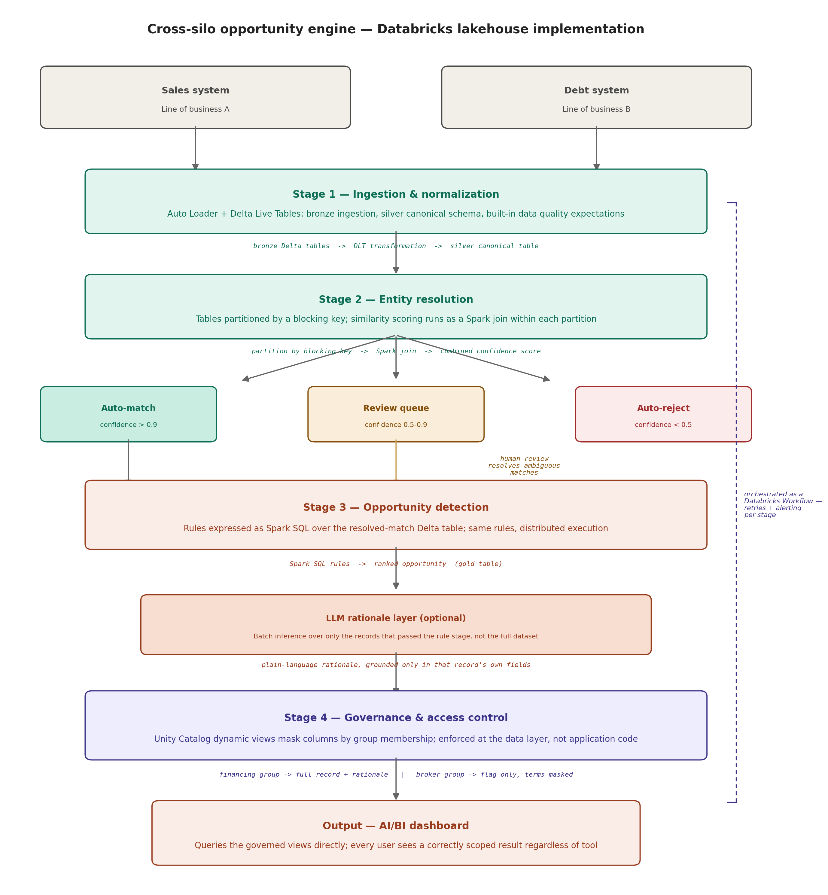

## Alternate implementation: Databricks lakehouse architecture

The same four-stage design can also be implemented natively on Databricks. The stages, the
responsibilities, and the governance-first principle stay the same — what changes is where
each stage runs and how it's enforced.

**Ingestion & normalization.** Each source lands as a bronze Delta table via Auto Loader, and
the normalization and validation logic becomes a Delta Live Tables transformation into a
silver canonical table — the same field-mapping and address/entity-name normalization, with
DLT's built-in data quality expectations handling invalid records natively instead of a
separate reject file.

**Entity resolution.** Both canonical tables are partitioned by a blocking key (postal code,
for example) so that only records already likely to be the same entity get compared, and the
similarity scoring runs as a Spark join within each partition. The same three-outcome model —
auto-match, review queue, auto-reject — carries over unchanged.

**Opportunity detection.** The same rules (maturity window, minimum value, relationship
strength) translate directly into Spark SQL over the resolved-match table, writing ranked
opportunities to a gold table. The optional LLM rationale step runs as batch inference over
just the records that passed the rule stage.

**Governance & access control.** This is where a lakehouse implementation is genuinely
stronger, not just a re-platformed version of the same thing. The role-based field scoping
becomes a Unity Catalog dynamic view, masking columns based on the querying user's group
membership — enforcement moves from application code to the data layer itself, so any query
against the table is scoped correctly regardless of what tool or user runs it.

**Orchestration & output.** The four stages run as a Databricks Workflow, one task per stage
with its own retry policy and failure alerting, and the final output is an AI/BI dashboard
querying the governed views directly — the dashboard itself never needs its own access-control
logic, since it inherits whatever the querying user is entitled to see.

The point of laying this out: the same design — canonical schema, confidence-scored matching,
rule-based detection, and governance built in from the first stage rather than bolted on at
the end — holds up cleanly whether it's running as a lightweight pipeline or a production
lakehouse. Only the execution and enforcement layer changes.
